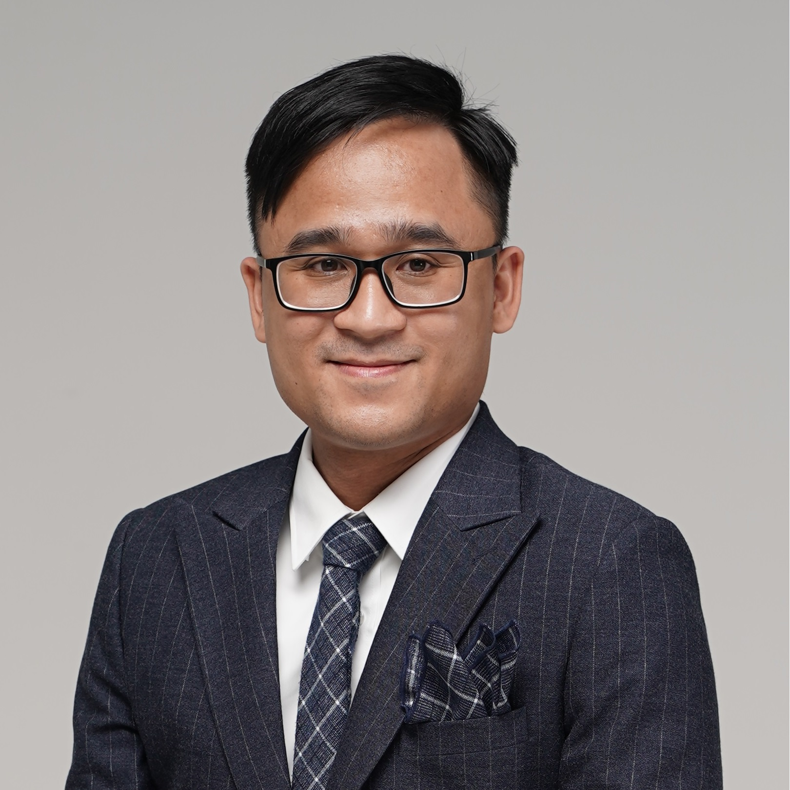

I am an *Associate Professor* in the Division of Computer Engineering, Department of Computer
Science and Engineering,
[The University of Aizu](https://www.u-aizu.ac.jp/en/). I received my Ph.D. from University of
Aizu
and my M.Sc. from University of Paris XI (Paris-Saclay University since 2019). Prior to joining the
University
of Aizu's faculty,
I was a faculty member of Vietnam National University, Hanoi. I also worked at [Dolphin-IC](https://www.dolphin-ic.com/) in the past.

**Research Interests:** My research spans *VLSI design*, *thermal-awareness*,
*fault-tolerance* and *neuromorphic computing*. In
particular, I have a strong interest in building on the 3D Integrated Circuit based neuromorphic computing
architecture that is highly-reliable and scalable enough to be safely and responsibly deployed in the real
world. 
([&#10159; More about Research]())

Email: khanh@u-aizu.ac.jp \[ [&#10159; Contact info](#contact) \]
*(Note: Email is by far the best way to reach me.)*

**Links**: [ [ORCID](https://orcid.org/0000-0001-6702-3870) \| [Google Scholar](https://scholar.google.com.vn/citations?user=mQbqkUMAAAAJ) \| [dblp](https://dblp.uni-trier.de/pid/184/5348.html) \| [Linkedin](https://www.linkedin.com/in/khanhndang) \| [WoS](https://www.webofscience.com/wos/author/record/2184844) \| [Github](https://github.com/khanhdang) \| [Google Patents](https://patents.google.com/?inventor=Nam+Khanh+Dang) \| [Lab Website](https://web-ext.u-aizu.ac.jp/misc/benablab/) \| [University Website](https://u-aizu.ac.jp/en) ] 

<i>For prospective GT undergraduate and graduate students, research topics (VLSI design, fault-tolerance or neuromorphic computing) are available; interested potential candidates please send me an  <a href="#contact">email</a>.  Partial financial supports for graduate students (equivalent to tuition fee) are
also possible. </i>
{: .announce}

# Selected Publications ( [&#10159;All Publications]() )

-  **Khanh N. Dang**, Nguyen Anh Vu Doan, Abderazek Ben Abdallah *"MigSpike: A Migration Based Algorithm and Architecture for Scalable Robust Neuromorphic Systems"*,  **IEEE Transactions on Emerging Topics in Computing (TETC)**,  IEEE, Volume 10, Issue 2, pp. 602-617, 2022.  \[[DOI: 10.1109/TETC.2021.3136028](https://doi.org/10.1109/TETC.2021.3136028)\] \[[PDF](./share/pubs/TETC-2021.pdf)\].
- **Khanh N. Dang**, Akram Ben Ahmed, Abderazek Ben Abdallah, Xuan-Tu Tran, *"HotCluster: A thermal-aware defect recovery method for Through-Silicon-Vias Towards Reliable 3-D ICs systems"*, **IEEE Transactions on Computer-Aided Design of Integrated Circuits and Systems**, IEEE, Volume 41, No. 4,  pp. 799-812, April 2022. \[[DOI: 10.1109/TCAD.2021.3069370](https://doi.org/10.1109/TCAD.2021.3069370)\]/\[[PDF](./share/pubs/TCAD-2021.pdf)\].
- **Khanh N. Dang**, Akram Ben Ahmed, Ben Abdallah Abderrazak and Xuan-Tu Tran, *"TSV-OCT: A Scalable Online Multiple-TSV Defects Localization for Real-Time 3-D-IC Systems"*, **IEEE Transactions on Very Large Scale Integration Systems (TVLSI)**, IEEE, Volume 28, Issue 3, pp. 672 - 685, 2020. \[[DOI: 10.1109/TVLSI.2019.2948878](https://doi.org/10.1109/TVLSI.2019.2948878)\]/\[[PDF](./share/pubs/TVLSI-2019.pdf)\].
-  **Khanh N. Dang**, Akram Ben Ahmed, Yuichi Okuyama, Abderazek Ben Abdallah, *"Scalable design methodology and online algorithm for TSV-cluster defects recovery in highly reliable 3D-NoC systems"*, **IEEE Transactions on Emerging Topics in Computing (TETC)**, IEEE, Volume 8, Issue 3, pp. 577-590, 2020. \[[DOI: 10.1109/TETC.2017.2762407](https://doi.org/10.1109/TETC.2017.2762407)\]/\[[PDF](./share/pubs/TETC-2017.pdf)\].

# Patents

1. **Khanh N. Dang**, A. Ben Abdallah, *“Program for generating migration flows for homogeneous computing systems and homogeneous computing devices” [ホ モジニアスコンピューティングシステム及びホモジニアスコ ンピューティングデバイスのマイグレーションフローの生成 プログラム]*, 特願 2022-196416, Japan patent, (filed patent).
1. A. Ben Abdallah, Zhishang Wang, **Khanh N. Dang**, Masayuki Hisada, *“EV Power Consumption Prediction Method and System for Power Management in Smart Grid [ スマートグリッドにおける電力管理のためのEV消 費電力予測 方法とシステム ]”*, 特願2020-194733, Japan patent, 2022 (filed patent).
1. A. Ben Abdallah, Huakun Huang, **Khanh N. Dang**, Jiangning Song, *"ＡＩプロセッサ (AI Processor)"*, 特願2020-194733, Japan patent, (patent pending).  \[[Google Patent](https://patents.google.com/patent/JP2022083341A/en)\].
2.  A. Ben Abdallah, **Khanh N. Dang**, Masayuki Hisada, *"Distance-aware Extended Parity Product Coding for multiple faults detection for on-chip links"*, 特願2020-171553, Japan patent, (patent pending) \[[Google Patent](https://patents.google.com/patent/JP2021190829A/en)\].
3. A. Ben Abdallah, **Khanh N. Dang**, *"A three-dimensional system on chip in which a TSV group including a plurality of TSVs provided to connect between layers"*, 特願2020-094220, JP2021190829A, Japan patent, (patent pending) \[[Google Patent](https://patents.google.com/patent/JP2022063152A/)\].
4. A. Ben Abdallah, **Khanh N. Dang**, Masayuki Hisada, *"A TSV fault-tolerant router system for 3D-Networks-on-Chip"*, 特願 2017-218953,
JP2019092020A, Japan (patent pending) \[[Google Patent](https://patents.google.com/patent/JP2019092020A/en)\].
{: reversed="reversed"}

# Grants 

1. *"Hotspot aware Fault-Tolerant Architectures and Algorithms for TSV-based 3D Network-on-Chips"*, main PI, funded by **National Foundation for Science and Technology Development (NAFOSTED)** under *No. 102.01-2018.312* (2019-2021).
1. *"Soft Error Resilient Architecture and Algorithm for Network-on-Chip"* : main PI, funded by **VNU University of Engineering and Technology (VNU-UET)** under project *No. CN18.10* (2018-2019).
1. *"Development of IoT Dual Band Transmitters for Agriculture (IOTA)"*, core member, funded by the **Ministry of Science and Technology (World Bank project)** (2018-2019).
1. *"Reconfiguration Solution in Designing Network-on-Chip Architectures "*, core member, funded by **National Foundation for Science and Technology Development (NAFOSTED)** under *No. 102.01-2013.17* (2014-2016).
1. *"Investigation, Design, and Implementation of a Video Encoder for Next Generation Multimedia Equipment"*, core member, funded by  **Vietnam National University, Hanoi (VNU)** under *No. QGĐA.10.02* (2010-2013).

# Awards

1. *Second Prize* (the 2nd best) of **Vietnamese Nhan Tai Dat Viet Award 2015**. The Second Prize awarded to our VENGME H.264/AVC encoding chip which I took part in the design team.
2. *Best Student Paper Award* at **International Symposium on Ubiquitous Networking (UNet 2021)** for paper:
Ogbodo Mark Ikechukwu, Khanh N. Dang and Abderazek Ben. Abdallah, “Energy-efficient Spike-based Scalable Architecture for Next-generation Cognitive AI Computing Systems”.  [\[Certificate\]](assets/awards/2021-Unet.jpg)

# Teaching

## Current Courses 
- PL03: プログラミングJAVA I \| JAVA Programming I (Ex.), University of Aizu, *Undergraduate*,  Q1.
- FU03: 離散系論 \| Discrete Systems (Lec./Ex.), University of Aizu, *Undergraduate*, Q2.
- SE08: データマイニング概論 \| Introduction of Data Mining (Ex.), University of Aizu, *Undergraduate*, Q3.
- FU06: オペレーティングシステム論 \| Operating Systems (Ex.), University of Aizu, *Undergraduate*,  Q4.

## Previous Courses
  
- INT2212: Computer Architecture, VNU-UET, *Undergraduate*.
- ELT3071: Real-time Embedded Systems, VNU-UET, *Undergraduate*.
- INT3409: Robotics Programming, VNU-UET, *Undergraduate*.
- ELT2401: Digital Electronics, VNU-UET, *Undergraduate*.
- SYC04: Advanced Computer Organization, Uni. of Aizu, *Graduate*, invited lecturer, 2019.
- SYC04: Advanced Computer Organization, Uni. of Aizu, *Graduate*, invited lecturer, 2021.

# Professional Service

## Special Issues
-  Journal of Low Power Electronics and Applications (ESCI/Scopus): ''Advances in Embedded Artificial Intelligence and Internet-of-Things'', \[[URL](https://www.mdpi.com/journal/jlpea/special_issues/DU85TF44GS)\]

## Conferences Organizing
- TPC co-chair: IEEE MCSoC 2019, IEEE APPCAS 2020, IEEE MCSoC 2021, IEEE MCSoC 2022
- Publication chair: IEEE MCSoC 2018
- Session chair: IEEE APCCAS 2021
- TPC member: IEEE MCSoC 2018, IEEE MCSoC 2019, IEEE ICCE 2020, IEEE APCCAS 2020, IEEE MCSoC 2021, IEEE APCCAS 2021

## Academic activities
- Member of IEEE, IEEE CAS and IEEE SSCS
- Technical Presenter/Chapter representative at The 3nd IEEE South-East Asia Workshop on Circuits and Systems (SEACAS 2019)
- Technical Presenter/Chapter representative at The 2nd IEEE South-East Asia Workshop on Circuits and Systems (SEACAS 2018)
- Technical presentation at The 1st IEEE South-East Asia Workshop on Circuits and Systems (SEACAS 2017)
- Member of 2020 CASS COVID-19 Special Student Design Competition Judging Panel in ISCAS 2020 

## Revieweing

- **Journal**: ACM Journal on Emerging Technologies in Computing Systems, Applied Sciences, Elsevier Journal of Systems Architecture, Electronics, Frontiers in Computational Neuroscience, Frontiers in Neuroscience, IEEE Transactions on Circuits and Systems I : Regular Papers, IEEE Access, Journal of Supercomputing, Microprocessors and Microsystems, Microelectronics Journal
- **Conference**: IEEE MCSoC 2017, IEEE MCSoC 2018, IEEE MCSoC 2019, IEEE ATC 2020, IEEE APCCAS 2020, IEEE ICCE 2020, IEEE ISCAS 2021, IEEE APCCAS 2021, ICCE 2022, MCSoC 2022, ATC 2022, RIFV 2022

<!-- # Current Students

- NGUYEN Ngo Doanh (M.Sc.) -->

# Contact

〒965-8580 University of Aizu, \\
Tsuruga, Ikki-Machi, \\
Aizu-Wakamatsu, Fukushima, Japan \[[map](https://goo.gl/maps/9CYKa1HMB4EZjKW27)\]  \\
Email: khanh@u-aizu.ac.jp \\
Tel.: +81-242-37-2721 (int. 3362) \\
Office: 204-I, Research Quadrangles

*Last update: June 10, 2022*
{: .lastupdate}