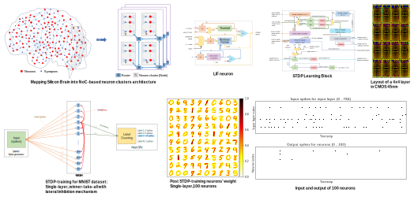
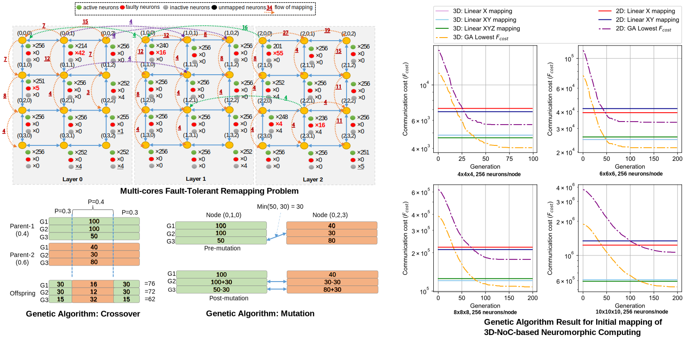
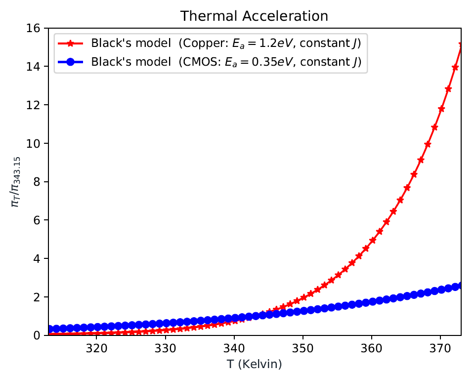
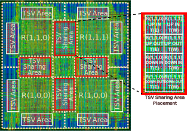

# Current  research

## Neuromorphic Computing

We develop hardware for neuromorphic computing that mimics the behavior of biological brains. Here, the main target is to port the silicon brains into ASIC/FPGA and train them with bio-plausible learning approaches. The hardware platform is based on Leaky-Integrate-and-Fire neuron with online STDP learning and possible off-line ANN-SNN conversion.

{::nomarkdown}

{:/}

The hardware is based on CMOS technology with 3D-ICs using Through-Silicon-Vias. Neurons are grouped into clusters that connected via a 3D Network-on-Chip. Inter-layer wires are Through-Silicon-Vias.

Selected publications:

1. Duy-Anh Nguyen, Xuan-Tu Tran, **Khanh N. Dang**, and Francesca Iacopi, *"A Low-Power, High-Accuracy with Fully On-Chip Ternary Weight Hardware Architecture for Deep Spiking Neural Networks"*, **Microprocessors and Microsystems**, Elsevier, Volume 90, pp. 104458, 2022. \[[DOI: 10.1016/j.micpro.2022.104458](https://doi.org/10.1016/j.micpro.2022.104458)\] \[[PDF](./share/pubs/MICPRO-2022.pdf)\] \[[Source code](https://github.com/khanhdang/TW-SNN)\]. 
2.  **Khanh N. Dang**, Nguyen Anh Vu Doan, Abderazek Ben Abdallah *"MigSpike: A Migration Based Algorithm and Architecture for Scalable Robust Neuromorphic Systems"*,  **IEEE Transactions on Emerging Topics in Computing (TETC)**,  IEEE, Volume 10, Issue 2, pp. 602-617, 2022.  \[[DOI: 10.1109/TETC.2021.3136028](https://doi.org/10.1109/TETC.2021.3136028)\] \[[PDF](./share/pubs/TETC-2021.pdf)\].
3. Abderazek Ben Abdallah, **Khanh N. Dang**, *"Towards Robust Cognitive 3D Brain-inspired Cross-paradigm System"*, **Frontiers in Neuroscience**, Frontiers, Volume 15, pp. 795, 2021. \[[DOI: 10.3389/fnins.2021.690208](https://doi.org/10.3389/fnins.2021.690208)\]/\[[PDF](./share/pubs/FNINS-2021.pdf)\].
4. Ogbodo Mark Ikechukwu, **Khanh N. Dang** and Abderazek Ben. Abdallah, *"Energy-efficient Spike-based Scalable Architecture for Next-generation Cognitive AI Computing Systems"* Springer Lecture  Note in Computer Science (LNCS), **International Symposium on Ubiquitous Networking 2021 (UNET21)**, May 19 – May 22, 2021, Marakesh, Morocco. <a role="button" href="./2021/05/22/Best_Paper_Award_Unet.html" class="btn btn-outline-success btn-sm">Best Student Paper Award</a>
5. Mark Ogbodo, **Khanh N. Dang**,  Abderazek Ben Abdallah,  *"On the Design of a  Fault-tolerant Scalable Three Dimensional NoC-based  Digital Neuromorphic System with On-chip Learning"*, **IEEE Access**, IEEE, Volume 9, pp 64331 - 64345, 2021. \[[DOI](https://doi.org/10.1109/ACCESS.2021.3071089)\]/\[[PDF](https://ieeexplore.ieee.org/stamp/stamp.jsp?tp=&arnumber=9395458)\].
6. Duy-Anh Nguyen, Xuan-Tu Tran, **Khanh N. Dang**, and Francesca Iacopi,  *"A lightweight Max-Pooling method and architecture for Deep Spiking Convolutional Neural Networks"*,  **2020 IEEE Asia Pacific Conference on Circuits and Systems (APCCAS)**, Dec. 8-10, 2020.
7. Mark Ogbodo, The Vu, **Khanh N. Dang** and Abderazek Abdallah, *"Light-weight Spiking Neuron Processing Core for Large-scale 3D-NoC based Spiking Neural Network Processing Systems"*, **2020 IEEE International Conference on Big Data and Smart Computing (BigComp)**, Feb. 19-22, 2020.

Patent:

1. A. Ben Abdallah, Huakun Huang, **Khanh N. Dang**, Jiangning Song, *"ＡＩプロセッサ (AI Processor)"*, 特願2020-194733, Japan patent, (patent filed)
1. **Khanh N. Dang**, A. Ben Abdallah, *"Neuron migration for fault tolerant homogeneous AI computing"*, Japan patent, 2022 (filed patent).

## Machine Learning for Computer-Aided Design

In this project, we  develop an Machine Learning framework for designing and maintaince multi/many-core system.  One of our research approach is to convert the constraints in the design phases (i.e., area, power, reliability, thermal) into a multiple-objective optimization. Here, we solve the problems using Genetic Algorithm (GA). 

{::nomarkdown}

{:/}

Selected publications:

1.  **Khanh N. Dang**, Nguyen Anh Vu Doan, Abderazek Ben Abdallah *"MigSpike: A Migration Based Algorithm and Architecture for Scalable Robust Neuromorphic Systems"*,  **IEEE Transactions on Emerging Topics in Computing (TETC)**,  IEEE, Volume 10, Issue 2, pp. 602-617, 2022.  \[[DOI: 10.1109/TETC.2021.3136028](https://doi.org/10.1109/TETC.2021.3136028)\] \[[PDF](./share/pubs/TETC-2021.pdf)\].
2. Abderazek Ben Abdallah, **Khanh N. Dang**, *"Towards Robust Cognitive 3D Brain-inspired Cross-paradigm System"*, **Frontiers in Neuroscience**, Frontiers, Volume 15, pp. 795, 2021. \[[DOI: 10.3389/fnins.2021.690208](https://doi.org/10.3389/fnins.2021.690208)\]/\[[PDF](./share/pubs/FNINS-2021.pdf)\].
3. **Khanh N. Dang**, Akram Ben Ahmed, Fakhrul Zaman Rokhani, Abderazek Ben Abdallah, and Xuan-Tu Tran, *"A thermal distribution, lifetime reliability prediction and spare TSV insertion platform for stacking 3D NoCs"*, **2020 International Conference On Advanced Technologies For Communications (ATC)**, Nov. 8-10, 2020.

---

<!-- --- -->
# Previous topics

## Thermal-aware 3D-ICs
<!-- : [>> more detail](./research_topics/thermal3DICs) -->

As thermal dissipation is one of the most critical challenges for stacking 3D-ICs and the Mean Time to Failure (MTTF) decreases exponentially with the operating temperature as in Black’s mode. In this research, we target to develop algorithms and architectures to solve the lifetime reliability of 3D-ICs with awareness of thermal impact.

{::nomarkdown}

{:/}
Normalized thermal acceleration for lifetime reliability of CMOS and Copper with the Black's model. The fault rates are normalized to 343.15K (70°C).
In  in 80°C, the fault rates are 2x and 3x of 70°C for CMOS and Copper, respectively.

{::nomarkdown}

{:/}
The HotCluster platform to predict the fault rate and to place spare modules. Details in [here](https://doi.org/10.1109/TCAD.2021.3069370).

Selected publications:

1. **Khanh N. Dang**, Akram Ben Ahmed, Abderazek Ben Abdallah, Xuan-Tu Tran, *"HotCluster: A thermal-aware defect recovery method for Through-Silicon-Vias Towards Reliable 3-D ICs systems"*, **IEEE Transactions on Computer-Aided Design of Integrated Circuits and Systems**, **(in press)**. \[[DOI](https://doi.org/10.1109/TCAD.2021.3069370)\]/\[[PDF](./share/TCAD-2021.pdf)\].
1. **Khanh N. Dang**, Akram Ben Ahmed, Abderazek Ben Abdallah, Xuan-Tu Tran, *"A thermal-aware on-line fault tolerance method for TSV lifetime reliability in 3D-NoC systems"*, **IEEE Access**, IEEE, Volume 8, pp 166642-166657, 2020. \[[DOI](https://doi.org/10.1109/ACCESS.2020.3022904 )\]/\[[PDF](./share/09189765.pdf)\].
1. **Khanh N. Dang**, Akram Ben Ahmed, Ben Abdallah Abderrazak and Xuan-Tu Tran, *"TSV-OCT: A Scalable Online Multiple-TSV Defects Localization for Real-Time 3-D-IC Systems"*, **IEEE Transactions on Very Large Scale Integration Systems (TVLSI)**, IEEE, Volume 28, Issue 3, pp 672 - 685, 2020. \[[DOI](https://doi.org/10.1109/TVLSI.2019.2948878)\]/\[[PDF](./share/TVLSI-2019.pdf)\].
1. **Khanh N. Dang**, Michael Meyer, Akram Ben Ahmed, Abderazek Ben Abdallah, and Xuan-Tu Tran, *"A non-blocking non-degrading multi-defect link test method for 3D-Networks-on-Chip"*, **IEEE Access**, IEEE, Volume 8, pp 59571 - 59589, 2020. \[[DOI](https://doi.org/10.1109/ACCESS.2020.2982836)\]/\[[PDF](./share/ACCESS-2020.pdf)\].

Patents:

1. A. Ben Abdallah, **Khanh N. Dang**, Masayuki Hisada, *"Distance-aware Extended Parity Product Coding for multiple faults detection for on-chip links"*,特願2020-171553, Japan patent, (patent filed)
1. A. Ben Abdallah, **Khanh N. Dang**, *"A three-dimensional system on chip in which a TSV group including a plurality of TSVs provided to connect between layers"*, 特願2020-094220, Japan patent, (patent filed)

## Fault-tolerant Network-on-Chip architecture

I am a member of the project as a Ph.D. student at [ASL](http://adaptive.u-aizu.ac.jp) from 2014 to 2017. 
We developed a comprehensive solution to tackle the reliability of on-chip interconnect. 
We have developed tolerance method for the permanent (hard), transient (soft), and TSV defect.

Selected publications:

1. **Khanh N. Dang**, Akram Ben Ahmed, Yuichi Okuyama, Abderazek Ben Abdallah, *"Scalable design methodology and online algorithm for TSV-cluster defects recovery in highly reliable 3D-NoC systems"*, **IEEE Transactions on Emerging Topics in Computing (TETC)**, IEEE, Volume 8, Issue 3, pp 577-590, 2020. \[[DOI](https://doi.org/10.1109/TETC.2017.2762407)\]/\[[PDF](../share/TETC-2017.pdf)\].
2. **Khanh N. Dang**, Akram Ben Ahmed, Xuan-Tu Tran, Yuichi Okuyama, Abderazek Ben Abdallah, *"A Comprehensive Reliability Assessment of Fault-Resilient Network-on-Chip Using Analytical Model"*, **IEEE Transactions on Very Large Scale Integration Systems (TVLSI)**, IEEE, Volume 25, Issue 11, pp 3099-3112, 2017. \[[DOI](https://doi.org/10.1109/TVLSI.2017.2736004)\]/\[[PDF](../share/TVLSI-2017.pdf)\].
3. **Khanh N. Dang**, Michael Meyer, Yuichi Okuyama, Abderazek Ben Abdallah, *"A Low-overhead Soft-Hard Fault Tolerant Architecture, Design and Management Scheme for Reliable High-performance Many-core 3D-NoC Systems"*, **Journal of Supercomputing (SUPE)**, Springer, Volume 73, Issue 6, pp 2705–2729, 2017. \[[DOI](https://link.springer.com/article/10.1007/s11227-016-1951-0)\]/\[[PDF](../share/SUPE-2017.pdf)\].

Patent:

1. A. Ben Abdallah, **Khanh N. Dang**, Masayuki Hisada, *"A TSV fault-tolerant router system for 3D-Networks-on-Chip"*, 特願 2017-218953,
JP2019092020A, Japan (patent pending) \[[URL](https://patents.google.com/patent/JP2019092020A/en)\].

{::nomarkdown}

{:/}

*Caption:* The layout of a layer 2x2 in OASIS project: NANDGATE 45nm, NCSU FreePDK TSV. The TSV size, pitch and Keep-out Zone are 4.06umx4:06um,
10um, and 15um, respectively. TSV area is shared between the neighboring routers for tolerating TSV defect. 

## Full hardware H.264/AVC encoder
<!-- : [>> more detail](./research_topics/h264) -->

I am a core member of the project from 2011 to 2014. We developed a full hardware H.264/AVC encoder.  My major task is to develop the inter-prediction module.

Selected publications:

1. Ngoc-Mai Nguyen, Edith Beigne, Duy-Hieu Bui, *Nam-Khanh Dang*, Suzanne Lesecq, Pascal Vivet, Xuan-Tu Tran, *"An Overview of H.264 Hardware Encoder Architectures including Low-Power Features"*, **REV Journal on Electronics and Communications (JEC)**, REV, pp. 8-17, Vol. 4, No. 1-2, Jan. - Jun., 2014. \[[DOI/PDF](http://dx.doi.org/10.21553/rev-jec.72)\].
1. Ngoc-Mai Nguyen, Edith Beigne, Suzanne Lesecq, Duy-Hieu Bui, *Nam-Khanh Dang*, Xuan-Tu Tran, *"H.264/AVC Hardware Encoders and Low-Power Features"*, **2014 IEEE Asia Pacific Conference on Circuits & Systems (APCCAS)**, Nov. 17-20, 2014.
1. *Nam-Khanh Dang*, Xuan-Tu Tran, Alain Merigot, *"An Efficient Hardware Architecture for Inter-Prediction in H.264/AVC Encoders"*, **17th IEEE Symposium on Design and Diagnostics of Electronic Circuits and Systems (DDECS)**, Apr. 23-25, 2014.
1. Hai-Phong Phan, Hung K. Nguyen, Duy-Hieu Bui, *Nam-Khanh Dang*, Xuan-Tu Tran, *" System-on-Chip Testbed for Validating the Hardware Design of H.264/AVC Encoder"*, **National Conference on Electronics and Communications (REV2013-KC01)**, Hanoi, Dec., 2013. 
1. *Nam Khanh Dang*, Van-Mien Nguyen, Xuan Tu Tran, *"A VLSI Implementation for Inter-Prediction Module in H.264/AVC Encoders"*, **2013 International Conference on Integrated Circuits and Devices in Vietnam (ICDV)**, 2013.

{::nomarkdown}
<img src="assets/images/research_topics/h264/VENGME.png" class="icenter" width=70%
{:/}

*Caption:* The chip photograph: Global Foundry CMOS 130nm, 4mmx4mm, 100MHz, 1.2 V, 32mW, QFP256. 

The detail of the chip could be found [here](https://www.nict.go.jp/en/asean_ivo/4otfsk000029wocm-att/Xuan-Tu_Tran.pdf).

